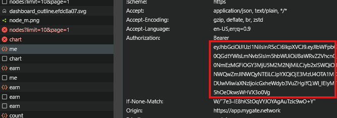

# MyGate Network Bot

Tool được phát triển bởi nhóm tele Airdrop Hunter Siêu Tốc (https://t.me/airdrophuntersieutoc)

## Features

- **Auto Generate Node ID**
- **Auto Connect/ping Node**
- **Auto Reconnect Node**

- **Support multiple accounts**
- **Support Proxy usage**
- **For Now Its Not Supported Creating Multiple Nodes for one account**

## Prerequisites

- Node.js installed on your machine
- `tokens.txt` file containing token my-gate platform follow instruction below to get:
- Open my-gate platform [https://mygate.network/](https://app.mygate.network/login?code=TIAMjB)
- Login With your gmail
- inspect or just F12, and find Network
- copy the token and save it in `tokens.txt`

  !

## Installation

1. Clone the repository:

   ```sh
   git clone https://github.com/Hunga9k50doker/mygate.git
   cd mygate
   ```

2. Install the required dependencies:
   ```sh
   npm install
   ```
3. Input your token in `tokens.txt` file, one user per line;
   ```sh
   nano tokens.txt
   ```
4. optionally you can use proxy:

- paste proxy in `proxy.txt` format `http://username:password@ip:port`
  ```sh
  nano proxy.txt
  ```

5. Run the script:
   ```sh
   npm run start
   ```

## For setup python:

1. **Instal Requirements:**

   ```bash
   pip install -r requirements.txt #or pip3 install -r requirements.txt
   ```

   ```bash
   python main.py #or python3 bot.py
   ```
